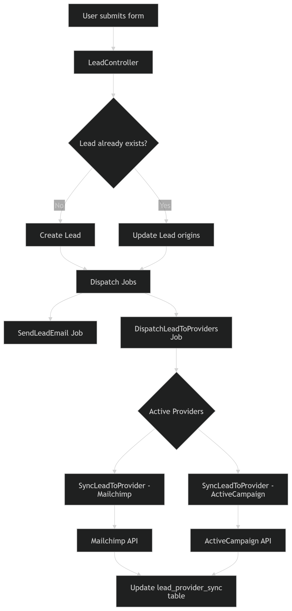
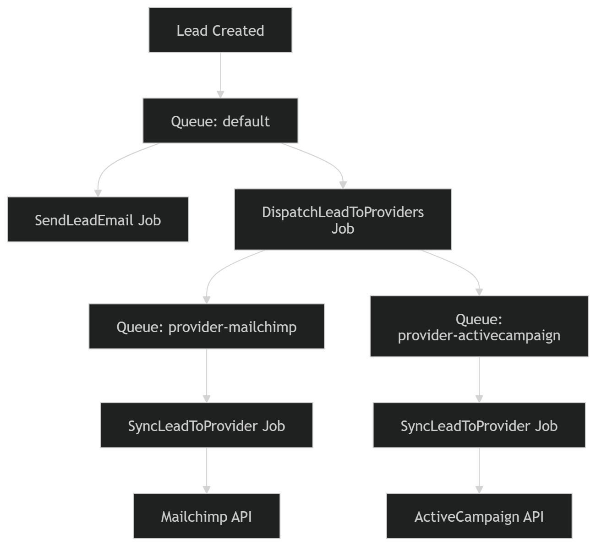
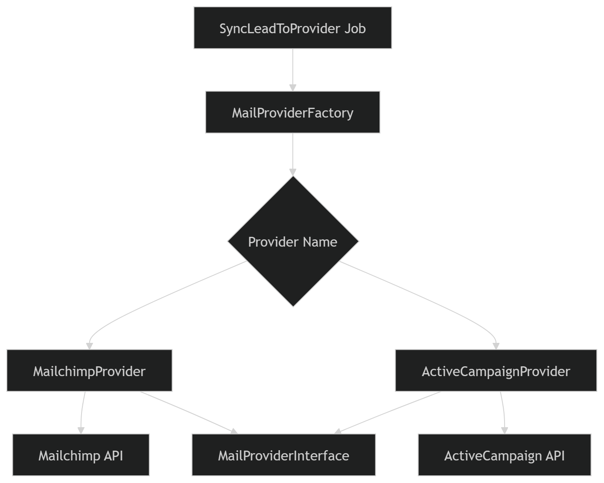
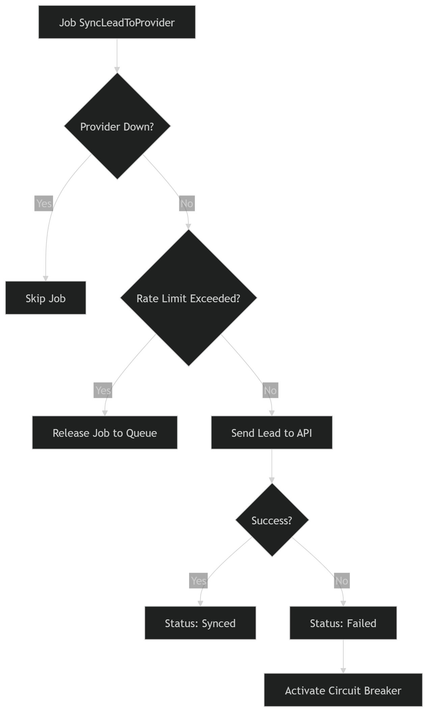

# Coisas Utilizadas até agora:

### Honey Pot e Throttle para evitar spam.
- Campos invisíveis (honeypot) e limitação de requisições (throttle) para impedir bots de enviarem formulários automaticamente.
<hr>

### Recaptcha v3
- O Google atribui um score de comportamento ao usuário. Com base nesse score decidimos se o envio do formulário é válido ou não
<hr>

### Envio de email automatico com retry apos envio do cadastro lead.
-  Após o cadastro do lead, um Job assíncrono envia o email.

- Caso ocorra falha temporária (ex: SMTP indisponível), o sistema realiza tentativas automáticas (retry) através da fila.

- Isso evita perda de emails e melhora a confiabilidade do sistema.

<hr>

### Evita envio de emails duplicados
- Se o email já existir:

- apenas atualiza o updated_at

- adiciona múltiplas origins ao lead

- Isso permite rastrear de onde o lead veio ao longo do tempo.

<hr>

### Log de auditoria para Leads
- Foi implementado log de auditoria utilizando: 
    - spatie/laravel-activitylog
- Agora todas as ações são registradas:
    - criação de lead

    - atualização

    - exclusão

- Isso facilita:
    - rastreabilidade

    - debugging

    - auditoria futura

<hr>

### Adicionado tabela roles para controle e gerenciamento de usuarios do sistema.
- Sistema de controle de permissões para usuários do sistema.

Exemplo:

```bash 
Admin
User
Manager
```

Isso permite restringir funcionalidades como:

- edição de leads

- exportação

- acesso ao dashboard

<hr>

### Dashboard para visualização rápida dos leads.
Criado um dashboard com visão resumida do sistema, permitindo visualizar rapidamente:
```bash 
quantidade de leads

tendências

dados recentes
```

<hr>

### Pagina de leads com filtros.
Interface de busca e filtragem contendo:

- filtro por data

- filtro por email

- filtro por origem

Isso facilita a análise e gerenciamento de leads.

<hr>

### Exportação de Leads.
Exportação para planilha com suporte a grandes volumes de dados.

O processamento ocorre via Queue, e ao finalizar o sistema envia notificação por email com o download.

Isso evita timeout de requisições HTTP.

<hr>

### 📡 Integração com Email Providers.
Foi criada uma arquitetura para integração com múltiplos provedores de email marketing, como:

- Mailchimp

- ActiveCampaign

- outros no futuro

A implementação utiliza Adapter Pattern + Factory Pattern para permitir que novos providers sejam adicionados sem alterar a lógica principal do sistema.

```bash
app/Services/MailProviders

Contracts/
    MailProviderInterface.php

MailchimpProvider.php
ActiveCampaignProvider.php
MailProviderFactory.php
```

Cada provider implementa uma interface comum:
```PHP
MailProviderInterface
```

Isso garante que todos os providers tenham o mesmo comportamento esperado, como por exemplo:
```
addLead()
```
A Factory decide qual provider instanciar dinamicamente com base no banco de dados.

<hr>

### ⚙️ Sistema de Sincronização de Leads com Providers

Foi criada uma arquitetura robusta de sincronização de leads com serviços externos.

Fluxo:
```
Lead criado
      ↓
Job envia email de confirmação
      ↓
Job DispatchLeadToProviders
      ↓
Um Job é criado para cada provider
      ↓
SyncLeadToProvider envia o lead para a API
```

Isso permite que cada integração seja processada de forma independente e escalável.

### 🚀 Filas separadas por Provider
Cada provider possui sua própria fila.

Exemplo:
```
provider-mailchimp
provider-activecampaign
```

Isso permite que integrações externas lentas não bloqueiem o sistema.

Para executar localmente:
```
php artisan queue:work --queue=provider-mailchimp
php artisan queue:work --queue=provider-activecampaign
```

Ou escutar múltiplas filas:
```
php artisan queue:work --queue=default,provider-mailchimp
```

<hr>

### 🧠 Estratégias de Resiliência implementadas
Para garantir estabilidade ao comunicar com APIs externas foram implementadas algumas estratégias usadas em sistemas distribuídos.

<hr>

#### Retry inteligente (Backoff exponencial)
Em caso de falha, o job tenta novamente utilizando intervalos progressivos:
```
30 segundos
2 minutos
5 minutos
```

Isso evita sobrecarregar APIs externas.

<hr>

#### Rate Limiting por provider
Cada provider possui limite de requisições por minuto.

Isso evita:

- bloqueio da API externa

- excesso de chamadas simultâneas

Implementado utilizando:

```
Laravel RateLimiter
```

<hr>

#### Circuit Breaker

Caso um provider esteja falhando constantemente, o sistema pausa temporariamente novas tentativas.

Exemplo:

```
cache key:
provider-down-{id}
```
Se a API falhar, o provider fica marcado como offline por alguns minutos, evitando novas tentativas até que o sistema volte ao normal.

Essa técnica protege o sistema contra cascatas de falhas.

<hr>

#### Status de sincronização

Cada envio de lead para um provider é registrado na tabela:
```
lead_provider_sync
```

Status possíveis:

```
pending
processing
synced
failed
```

Isso permite acompanhar exatamente:

- quando um lead foi enviado

- qual provider recebeu

- se houve erro

- quantas tentativas ocorreram

<hr>

#### 📊 Observabilidade

O sistema possui logs estruturados para rastrear:

- envio de lead para provider

- falhas de sincronização

- providers offline

- retry de jobs

Isso facilita monitoramento e debugging em produção.

✅ Com essa arquitetura o sistema suporta:

- múltiplos providers

- escalabilidade via filas

- tolerância a falhas

- controle de rate limit

- retry automático

- observabilidade


## 📐Arquitetura do sistema
### Fluxo geral do cadastro de lead



<hr>

### ⚙️ Fluxo das Queues



<hr>

### 🧠 Arquitetura dos Mail Providers (Adapter Pattern)



<hr>

### 🛡️ Fluxo de Resiliência (Rate Limit + Circuit Breaker)


